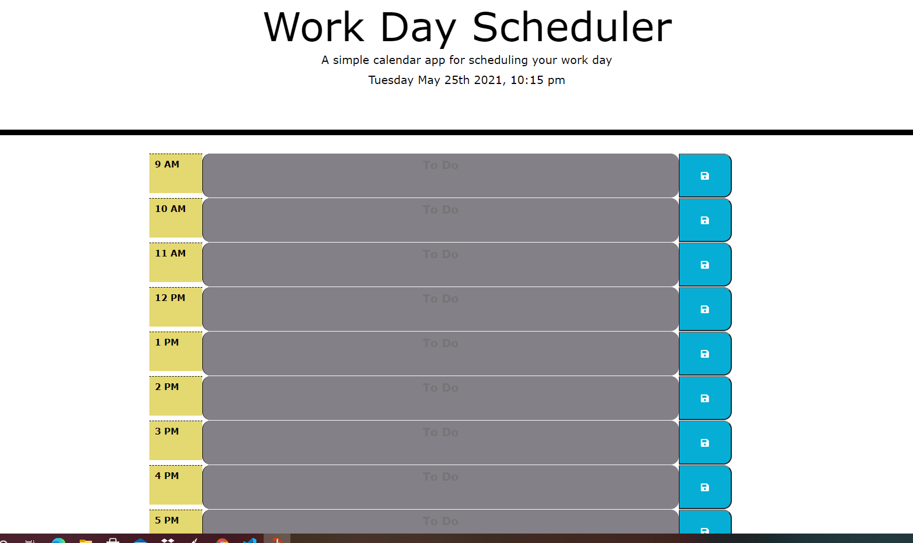

# day-planner
A simple calendar application that allows a user to save events for each hour of the day.

## Table of contents
- [Deployed Website](#deployedwebsite)
- [Description](#description)
- [Screenshots](#screenshots)
- [Tech/Framework](#tech/framework)
- [Contribution](#contribution)
- [License](#license)

## Deployed Website

 https://jessgreene9.github.io/day-planner/

## Description
This application allows the user to easily schedule their work day. The current hour block is displayed in purple, with the future hours displayed in green, and the past in gray. Using Moment.js, the current date is displayed upon opening the application. The user can then click on each time block and schedule their tasks for the day. When they click the save button to the right, their tasks for that block are saved to local storage and will remain on the page upon refresh. 

## Screenshots

## Tech/Framework

VS Code

## Contribution

This project was made with help from:

* UNCC BootCamp class
* My tutor, Josh Furlin

## License

